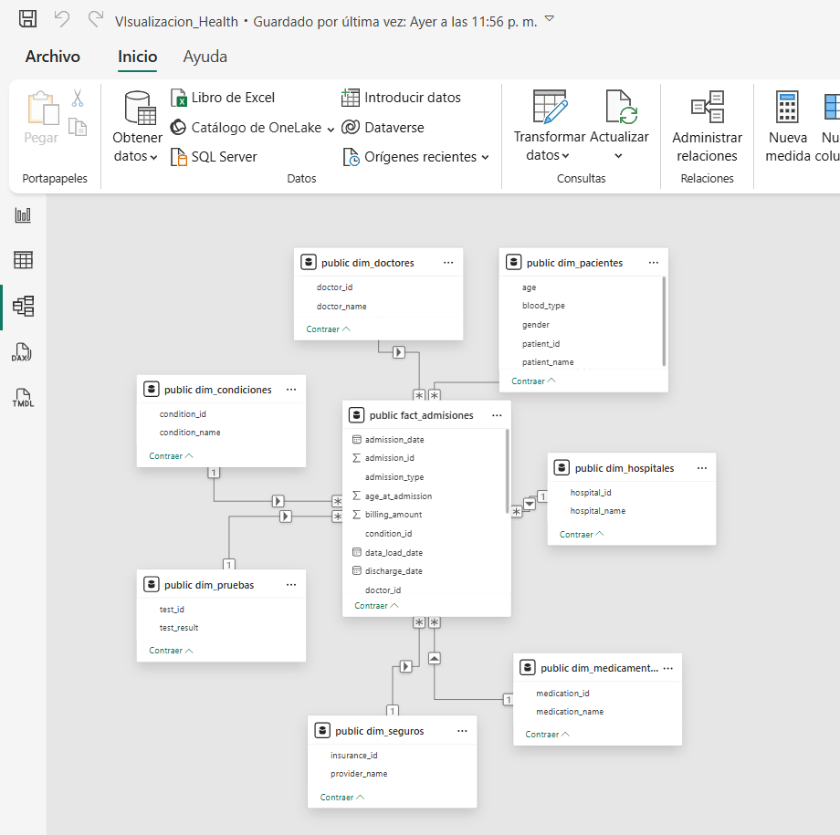
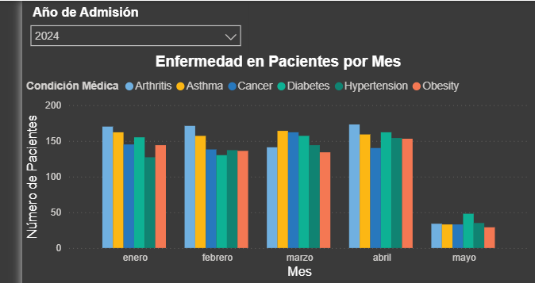
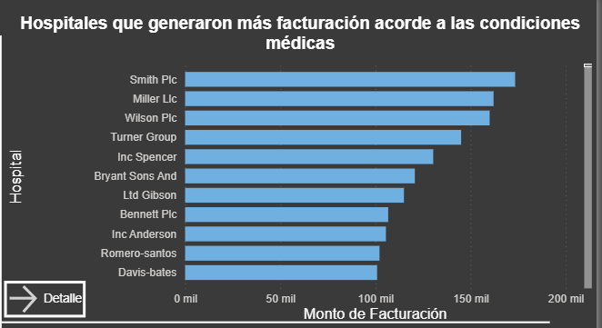
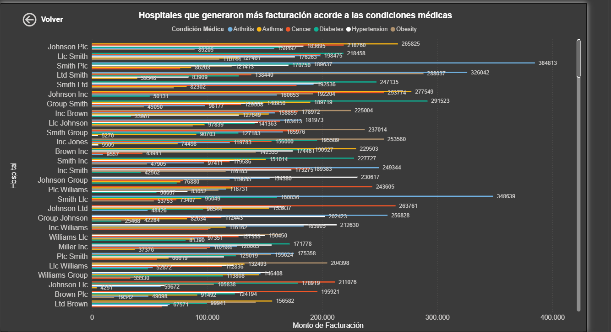
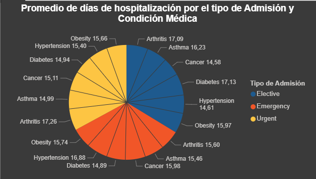
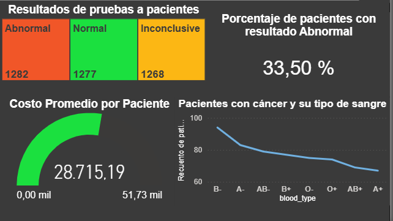

# 🚀 Decisiones Técnicas - Healthcare Analytics ETL

**Mi enfoque y razonamiento detrás de cada decisión arquitectónica.**

---

## 🎯 ¿Por Qué Hice Esto Así?

La idea principal fue crear un sistema donde **un solo comando (python run.py) ejecute todo automáticamente**. El usuario abre Telegram, hace `/start`, y el sistema se encarga del resto: limpia datos, los carga en la base de datos, y notifica en tiempo real. Todo en ~15 segundos. Así, el usuario tiene una experiencia fluida para consultar datos precisos sin tocar código ni terminal.

Además, lo diseñé pensando en **escalabilidad hacia otros KPIs**: si mañana quiero agregar análisis de mortalidad, reingresos, o costos por región, el sistema debería adaptarse con mínimos cambios.

---

## 🏗️ Las Decisiones Clave

### 1. **Un Comando, Todo Automático (Flujo Completo)**

Quería que el usuario simplemente ejecutara `python run.py` y se olvidara del resto. Sin pasos manuales, sin esperar a que escriba comandos SQL, sin confusiones.

Lo que pasa internamente:

1. **Bot se levanta en background** (hilo separado)
2. **Sistema espera** a que el usuario abra Telegram y haga `/start`
3. **Notebook se ejecuta automáticamente** (limpia datos)
4. **Datos se cargan en PostgreSQL** (Star Schema)
5. **Notificación llega al usuario** (Telegram)
6. **Bot queda activo** para consultas (4 análisis disponibles)

**¿Por qué threading?** Sin paralelismo, si el ETL tarda 15 segundos, el bot estaría muerto todo ese tiempo. Con threading, el bot está listo desde el segundo 1.

```python
# Bot en thread separado (~segundo 1)
bot_thread = Thread(target=start_bot, daemon=False)
bot_thread.start()

# Main thread ejecuta ETL (~segundos 2-16)
time.sleep(5)  # Espera a que bot esté listo
wait_for_chat_id()  # Solo continúa cuando usuario abre Telegram
run_pipeline()  # ETL completo
```

**Resultado:** El usuario obtiene una experiencia limpia, automatizada y profesional. No toca código, todo "just works".

---

### 2. **Captura Dinámica de Chat ID**

El `TELEGRAM_CHAT_ID` en `.env` está en blanco. ¿Por qué no configurarlo manualmente?

- Cada usuario que ejecute el sistema tendrá un `chat_id` diferente
- No quería que cada usuario tuviera que hacer pasos manuales antes de ejecutar
- La captura automática en `/start` resuelve esto de forma elegante

Cuando el usuario hace `/start` en Telegram, el bot captura su `chat_id` automáticamente y lo usa para los siguientes pasos. Simple y escalable a múltiples usuarios.

---

### 3. **Modelo de Datos: Star Schema**

Elegí **Star Schema (1 tabla de hechos + 7 dimensiones)** por razones prácticas:

**En ETL:**

- Es el estándar de la industria para procesos de ingesta
- Separar dimensiones = datos limpios y reutilizables
- Si agrego nuevos KPIs (mortalidad, reingresos), ya tengo las dimensiones base

**En PowerBI:**

- Cuando normalizamos datos y tenemos un buen esquema, PowerBI puede consumirlos con las **relaciones necesarias ya establecidas**
- Evitamos la sobrecarga de datos: una tabla de 54K filas en lugar de múltiples tablas normalizadas
- **Mejora el orden** para aplicar nuevos cálculos o medidas en PowerBI
- Los JOINs son mínimos y rápidos

Así, si mañana me piden "agregar análisis de edad" o "desglose por región", tengo las dimensiones listas.

---

### 4. **Bot de Telegram: Por Experiencia y Facilidad**

Elegiría Telegram porque:

- **Es gratuito:** Sin costos de infraestructura
- **Rápido de implementar:** La API es sencilla, documentación excelente
- **Tengo experiencia previa:** Ya lo había usado en otros proyectos, así que no pierdo tiempo aprendiendo
- **Multi-usuario nativo:** Un bot maneja N usuarios simultáneamente sin necesidad de servidor web adicional

Quería usar **Railway como servidor** para que el bot estuviera en línea 24/7, pero se me terminaron los créditos. Por eso está diseñado para ejecutarse localmente por ahora. Si tuviera créditos, desplegaría todo y sería totalmente funcional como SaaS.

**Ventaja arquitectónica:** Usar Telegram evita mantener un servidor web custom. La complejidad baja de 10 a 5.

---

### 5. **Notebook Jupyter para Limpieza**

¿Por qué no directamente un script Python?

- **Análisis por secciones:** Puedo ver qué sucede en cada paso (describe(), isna(), duplicates())
- **Documentación integrada:** Notas markdown explicando qué hace cada celda
- **Exploratorio:** Cuando los datos llegan nuevos, puedo verificar manualmente si necesitan cambios
- **Transformación antes de carga:** Las datos llegan limpios a la BD, sin sorpresas después

Uso `nbconvert` para automatizar su ejecución desde el pipeline. Así tengo lo mejor de ambos mundos: desarrollo explorador + automatización en producción.

---

### 6. **Scripts Separados: Responsabilidades Únicas**

Organicé el código en:

- `main.py` → Orquestación (coordina los pasos)
- `telegram_bot.py` → Todo lo relacionado con Telegram
- `data_cleaner.py` → Ejecución de Jupyter
- `model_factory.py` → Creación del Star Schema
- `db_connector.py` → Conexión y carga a PostgreSQL

**¿Por qué?** Cada script tiene **una responsabilidad única**. Si mañana cambio la lógica de Telegram, no toco ETL. Si agrego una nueva dimensión, solo modifico `model_factory.py`.

Esto hace el sistema **escalable a nuevas funcionalidades** sin romper nada.

---

### 7. **PostgreSQL con Encoding LATIN1**

Los datos contienen nombres españoles y caracteres especiales (ñ, á, é). LATIN1 maneja esto nativamente. UTF-8 también funcionaría, pero LATIN1 es directo sin validaciones adicionales.

---

## 🔄 El Flujo: Por Qué 8 Fases

| Fase  | Tarea                      | Tiempo | Razonamiento                                       |
| ----- | -------------------------- | ------ | -------------------------------------------------- |
| **0** | Iniciar Bot                | 1s     | Usuario debe tener acceso inmediato a Telegram     |
| **1** | Ejecutar Notebook          | 2-3s   | Limpieza = datos confiables para la BD             |
| **2** | Cargar CSV                 | 1-2s   | Lectura en memoria antes de transformación         |
| **3** | Generar Star Schema        | 1s     | Crear estructura dimensional normalizada           |
| **4** | Crear tablas en PostgreSQL | 2s     | Preparar BD con índices                            |
| **5** | Insertar datos             | 3-4s   | Cargar 54,966 filas                                |
| **6** | Crear índices              | 1-2s   | Optimizar queries (no ralentizar inserciones)      |
| **7** | Notificar y Bot activo     | 1s     | Usuario sabe que terminó, bot listo para consultas |

**Total: ~15 segundos.** El usuario abre Telegram en el segundo 2, escribe `/start`, y hacia el segundo 10 ya tiene notificación. Mientras tanto, los datos se están cargando.

---

## 📊 PowerBI Integration

Diseñé la carga de datos pensando en PowerBI desde el inicio. Con el **Star Schema bien estructurado:**

1. **Conectas PostgreSQL a PowerBI** (simple, solo credenciales)
2. **Las relaciones ya existen en el modelo** (fact_healthcare ↔ dimensiones)
3. **Evitas sobrecarga:** PowerBI no intenta hacer 100 JOINs para un gráfico
4. **Escalas análisis fácil:** Agregar una nueva medida es agregar una columna, no repensar todo
5. **Datos consistentes:** Lo que ves en Telegram = lo que ves en PowerBI

**Ejemplo:** Quiero un gráfico de "Costo promedio por condición médica"

- En PowerBI: Arrastro `condition` y `SUM(cost)`, listo
- Sin Star Schema: Tendría que escribir una query compleja con 5 JOINs

---

## 🎓 Lo Que Aplicué

### Conceptos de Data Engineering

- **ETL clásico:** Extract (CSV) → Transform (Jupyter) → Load (PostgreSQL)
- **Data Warehouse:** Star Schema es el patrón de DW
- **Modularidad:** Cada script = un responsable

### Conceptos de Arquitectura

- **Threading:** Paralelismo sin complejidad de multiprocessing
- **Polling:** Espera simple para sincronización (chat_id)
- **Separation of Concerns:** Datos ≠ UI ≠ Bot ≠ Orquestación

### Conceptos de UX

- **Automation first:** Un comando, todo listo
- **Feedback real-time:** Telegram notifica instantáneamente
- **Escalabilidad mental:** El usuario ve análisis, no procesos

---

## 📈 Resultados

| Métrica                     | Target | ¿Lo Logré?              |
| --------------------------- | ------ | ----------------------- |
| Ejecución con 1 comando     | Sí     | ✅ python run.py        |
| Automatización completa     | Sí     | ✅ Bot + ETL + SQL      |
| Notificación en tiempo real | Sí     | ✅ ~15 segundos         |
| Escalable a otros KPIs      | Sí     | ✅ Estructura preparada |
| Multi-usuario               | Sí     | ✅ N chats simultáneos  |
| Consumible en PowerBI       | Sí     | ✅ Star Schema listo    |

---

**Resumen:** Diseñé un sistema que **prioriza automatización, claridad y escalabilidad**. El usuario no toca código, el sistema hace todo, y está preparado para crecer con nuevos KPIs sin rediseño.

---

## 📊 PowerBI: Implementación y Validación

### Arquitectura de Conexión

Realicé la conexión a PostgreSQL desde PowerBI, importando los datos directamente. Al implementar un **modelo estrella**, PowerBI detecta automáticamente las **relaciones entre la tabla de hechos y las dimensiones**, lo que simplifica enormemente la creación de visualizaciones sin necesidad de escribir SQL.



---

### Análisis de Preguntas Clave: KPIs Implementados

Con esta estructura, validé que el sistema responde a las preguntas de negocio más importantes:

#### 1️⃣ **Volumen y Estacionalidad**

**Pregunta:** ¿Cuál es el volumen total de admisiones por mes? ¿Existe estacionalidad?

**Solución:** Implementé un filtro global por año que permite analizar las tendencias mes a mes, detectando patrones de estacionalidad en el número de admisiones hospitalarias.



---

#### 2️⃣ **Top Hospitales por Facturación**

**Pregunta:** ¿Cuáles son los 10 hospitales con mayor valor de facturación?

**Solución:** Gráfico de barras mostrando los top 10 hospitales por ingresos totales. Además, agregué un desglose detallado que permite ver qué condiciones médicas generaron la mayor facturación por cada hospital.



**Desglose de condiciones médicas por hospital:**



---

#### 3️⃣ **Tiempo Promedio de Hospitalización (LOS)**

**Pregunta:** ¿Cuál es el tiempo promedio entre admisión y alta hospitalaria?

**Solución:** Creé una medida calculada que muestra el promedio de _Length of Stay (LOS)_ por condición médica y tipo de admisión. Esto es crítico para evaluar eficiencia hospitalaria y costos de operación.



---

#### 4️⃣ **Resultados Anormales y Análisis de Riesgo**

**Pregunta:** ¿Qué porcentaje de registros tienen resultados anormales o incidencias negativas?

**Solución:** Visualicé el porcentaje de pruebas con resultados anormales respecto al total, permitiendo identificar tasas de complicaciones y riesgos por condición médica.



---

### KPI Adicional: Costo Promedio por Paciente

Implementé un **KPI crítico: costo promedio por paciente**, que permite a hospitales y aseguradoras validar si están cobrando y pagando respectivamente montos justos. Este indicador es fundamental para:

- **Control de costos:** Identificar desviaciones
- **Comparación interhospitalaria:** Benchmarking
- **Predicción de presupuestos:** Proyecciones futuras
- **Análisis por sangre:** Observé tendencias de diagnósticos (cancer) segmentadas por grupo sanguíneo, que varían según el período analizado

---

**Conclusión:** El sistema ETL + PowerBI valida que la arquitectura elegida soporta análisis de negocio compleios en tiempo real, permitiendo tomar decisiones basadas en datos confiables.
